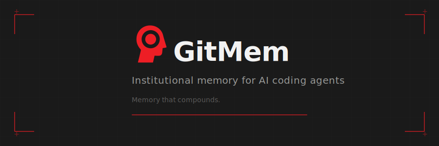

<p align="center">
  
</p>

<p align="center">
  <a href="https://www.npmjs.com/package/gitmem-mcp"></a>
  <a href="https://www.npmjs.com/package/gitmem-mcp"></a>
  <a href="https://github.com/gitmem-dev/gitmem/blob/main/LICENSE"></a>
  <a href="https://github.com/gitmem-dev/gitmem/actions/workflows/ci.yml"></a>
  = 22" />
</p>

<p align="center">
  <a href="https://gitmem.ai/docs"><strong>Documentation</strong></a> &middot;
  <a href="https://www.npmjs.com/package/gitmem-mcp"><strong>npm</strong></a> &middot;
  <a href="https://gitmem.ai/docs/getting-started"><strong>Getting Started</strong></a> &middot;
  <a href="https://gitmem.ai/docs/tools"><strong>Tool Reference</strong></a>
</p>

---

GitMem is an [MCP server](https://modelcontextprotocol.io/) that gives your AI coding agent **persistent memory across sessions**. It remembers mistakes (scars), successes (wins), and decisions — so your agent learns from experience instead of starting from scratch every time.

> **What's MCP?** [Model Context Protocol](https://modelcontextprotocol.io/) is how AI coding tools connect to external capabilities. GitMem is an MCP server — install it once and your agent gains persistent memory.

Works with **Claude Code**, **Cursor**, **VS Code (Copilot)**, **Windsurf**, and any MCP-compatible client.

## Quick Start

```bash
npx gitmem-mcp init
```

One command. The wizard auto-detects your IDE and sets up everything:
- `.gitmem/` directory with starter scars
- MCP server config (`.mcp.json`, `.vscode/mcp.json`, `.cursor/mcp.json`, etc.)
- Instructions file (`CLAUDE.md`, `.cursorrules`, `.windsurfrules`, `.github/copilot-instructions.md`)
- Lifecycle hooks (where supported)
- `.gitignore` updated

Already have existing config? The wizard merges without destroying anything. Re-running is safe.

```bash
npx gitmem-mcp init --yes                # Non-interactive
npx gitmem-mcp init --dry-run            # Preview changes
npx gitmem-mcp init --client vscode      # Force specific client
```

## How It Works

```
recall  -->  work  -->  learn  -->  close  -->  recall  -->  ...
```

1. **Recall** — Before acting, the agent checks memory for relevant lessons from past sessions
2. **Work** — The agent does the task, applying past lessons automatically
3. **Learn** — Mistakes become **scars**, successes become **wins**, strategies become **patterns**
4. **Close** — Session reflection persists context for next time

Every scar includes **counter-arguments** — reasons why someone might reasonably ignore it. This prevents memory from becoming a pile of rigid rules.

## What Gets Remembered

| Type | Purpose | Example |
|------|---------|---------|
| **Scars** | Mistakes to avoid | "Always validate UUID format before DB lookup" |
| **Wins** | Approaches that worked | "Parallel agent spawning cut review time by 60%" |
| **Patterns** | Reusable strategies | "5-tier test pyramid for MCP servers" |
| **Decisions** | Architectural choices with rationale | "Chose JWT over session cookies for stateless auth" |
| **Threads** | Unfinished work that carries across sessions | "Rate limiting still needs implementation" |

## Key Features

- **Automatic Recall** — Scars surface before the agent takes similar actions
- **Session Continuity** — Context, threads, and rapport carry across sessions
- **Closing Ceremony** — Structured reflection captures what broke, what worked, and what to do differently
- **20+ MCP Tools** — Full toolkit for memory management, search, threads, and multi-agent coordination
- **Zero Config** — `npx gitmem-mcp init` and you're running
- **Non-Destructive** — Merges with your existing `.mcp.json`, `CLAUDE.md`, and hooks

## Supported Clients

| Client | Setup | Hooks |
|--------|-------|-------|
| **Claude Code** | `npx gitmem-mcp init` | Full (session, recall, credential guard) |
| **Cursor** | `npx gitmem-mcp init --client cursor` | Partial (session, recall) |
| **VS Code (Copilot)** | `npx gitmem-mcp init --client vscode` | Instructions-based |
| **Windsurf** | `npx gitmem-mcp init --client windsurf` | Instructions-based |
| **Claude Desktop** | Add to `claude_desktop_config.json` | Manual |
| **Any MCP client** | `npx gitmem-mcp init --client generic` | Instructions-based |

The wizard auto-detects your IDE. Use `--client` to override.

<details>
<summary><strong>Manual MCP configuration</strong></summary>

Add this to your MCP client's config file:

```json
{
  "mcpServers": {
    "gitmem": {
      "command": "npx",
      "args": ["-y", "gitmem-mcp"]
    }
  }
}
```

| Client | Config file |
|--------|-------------|
| Claude Code | `.mcp.json` |
| Cursor | `.cursor/mcp.json` |
| VS Code | `.vscode/mcp.json` |
| Windsurf | `~/.codeium/windsurf/mcp_config.json` |

</details>

## CLI Commands

| Command | Description |
|---------|-------------|
| `npx gitmem-mcp init` | Interactive setup wizard (auto-detects IDE) |
| `npx gitmem-mcp init --client <name>` | Setup for specific client (`claude`, `cursor`, `vscode`, `windsurf`, `generic`) |
| `npx gitmem-mcp init --yes` | Non-interactive setup |
| `npx gitmem-mcp init --dry-run` | Preview changes |
| `npx gitmem-mcp uninstall` | Clean removal (preserves `.gitmem/` data) |
| `npx gitmem-mcp uninstall --all` | Full removal including data |
| `npx gitmem-mcp check` | Diagnostic health check |

## Pro Tier — Coming Soon

| What you get | Why your agent cares |
|-------------|---------------------|
| **Semantic search** | Recall returns the *right* scars, not keyword noise |
| **Session analytics** | Spot patterns in what keeps going wrong |
| **Sub-agent briefing** | Hand institutional context to sub-agents automatically |
| **Cloud persistence** | Memory survives machine changes, shareable across team |
| **A/B testing** | Optimize scar phrasing based on what actually changes behavior |

The free tier gives you everything for solo projects. Pro makes recall smarter and memory portable.

[Join the mailing list](https://gitmem.ai) to get notified.

## GitMem + MEMORY.md

Your AI agent likely has its own memory file (MEMORY.md, .cursorrules, etc.). Here's how they work together:

| | MEMORY.md | GitMem |
|---|-----------|--------|
| **Loaded** | Every turn (system prompt) | On-demand (tool calls) |
| **Best for** | Preferences, shortcuts, quick reference | Earned lessons, unfinished work, decisions |
| **Updates** | Agent writes directly | Session lifecycle (close ceremony) |
| **Example** | "User prefers terse output" | "Always validate UUID before DB lookup" |

**Tip:** Include `.gitmem/agent-briefing.md` in your MEMORY.md for a lightweight bridge between the two systems.

## Privacy & Data

- **Local-first** — All data stored in `.gitmem/` on your machine by default
- **No telemetry** — GitMem does not collect usage data or phone home
- **Cloud opt-in** — Pro tier Supabase backend requires explicit configuration via environment variables
- **Your data** — Sessions, scars, and decisions belong to you. Delete `.gitmem/` to remove everything

## Development

```bash
git clone https://github.com/gitmem-dev/gitmem.git
cd gitmem
npm install
npm run build
npm test
```

See [CONTRIBUTING.md](CONTRIBUTING.md) for full development setup.

## License

MIT — see [LICENSE](LICENSE).
